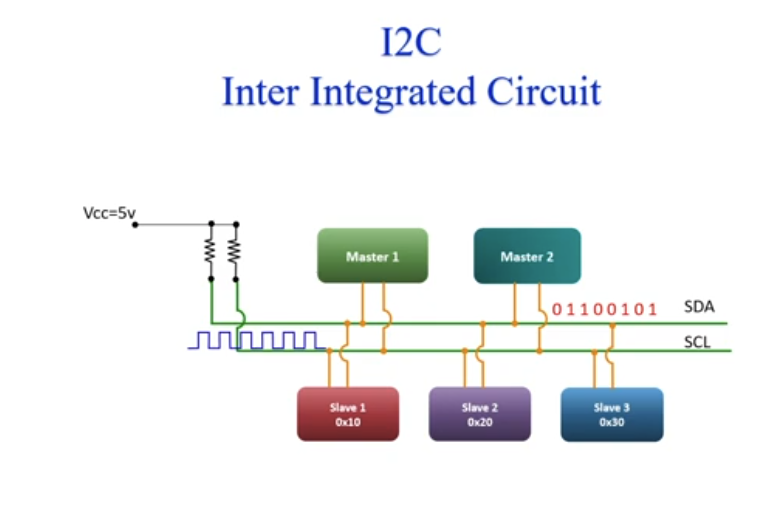
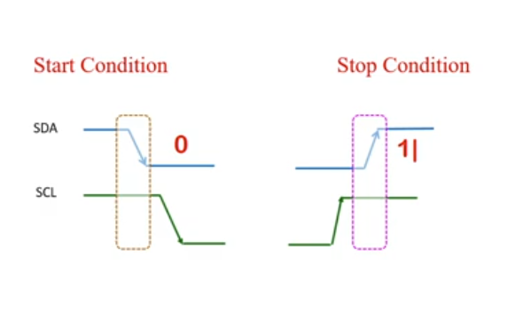

What is I2C (Inter-Integrated Circuit), and what are it's features? #i2c #embedded

---



**I2C** is a **two-wire**, **serial**, **synchronous** bus for **short-distance**, **on-board** links between a processor/MCU and low-speed peripherals.

- **Wiring**
  - **SDA (Serial Data)** — carries address, R/W, and data bits (e.g. `01100101`)
  - **SCL (Serial Clock)** — timing reference; the **master** toggles the clock so slaves know when to sample SDA
  - **Pull-ups to Vcc** — SDA and SCL are **open-drain**; resistors pull both lines **high** when idle; any device may pull a line **low**
  - **Half duplex** — one bit at a time on SDA; not simultaneous send/receive like SPI
- **Topology**
  - **Multi-master, multi-slave** on one bus
  - Masters share the bus with **arbitration**; slaves are selected by **unique addresses** (e.g. `0x10`, `0x20`, `0x30`)
- **Addressing**
  - **7-bit** address-based communication (10-bit extension in some systems)
- **Frequency**
  - Typically **100 kbps** (Standard mode) to **400 kbps** (Fast mode); higher modes exist on some devices
- **Bus management**
  - **Arbitration** — handles multi-master contention
  - **Clock stretching** — slave can hold SCL low to slow the master
- **Data & framing**
  - **Byte-oriented** protocol; **ACK** after every transmitted byte
  - Data sent in defined **frames** (start → address → R/W → ACK → data → ACK → … → stop)
- **Use case & range**
  - Connects low-speed peripherals to processors and microcontrollers
  - **Short distance, intra-board** communication

%%%MOCHI_CARD%%%
How does an I2C transaction work from start to stop? #i2c #embedded

---

**Lines:** **SDA** (Serial Data) and **SCL** (Serial Clock). Both are **open-drain** with **pull-ups**; the master drives the clock, and either side can pull lines low.

**Typical sequence:**

1. **Start condition**
   - Master pulls **SDA low while SCL is high**, then pulls **SCL low**.
   - Signals the beginning of a transfer; the bus was idle (both lines high).
2. **Slave address**
   - Master sends **7 address bits** (MSB first) on SDA, clocked by SCL.
   - Each slave compares the address to its own (e.g. `0x10`, `0x20`, `0x30`).
3. **R/W bit**
   - One bit after the address: **0 = write** (master → slave), **1 = read** (slave → master).
4. **ACK bit**
   - The **receiver** pulls **SDA low** on the 9th clock pulse to acknowledge.
   - **NACK** (SDA high) means "no device accepted" or "no more data."
5. **Data byte(s) + ACK**
   - Each **8-bit byte** is sent MSB first, followed by an **ACK/NACK** from the receiver.
   - Repeat for every byte in the transfer.
6. **Stop condition**
   - Master releases the bus by bringing **SCL high**, then **SDA high** (while SCL is high).
   - Returns the bus to idle.

> **Multi-master note:** If two masters start at once, **arbitration** on SDA resolves who keeps the bus; the loser backs off and retries later.


%%%MOCHI_CARD%%%
What is the structure of an I2C frame, and what is each field for? #i2c #embedded

---

```text
+-------+---------------+-----+-----+------+-----+------+-----+------+-----+-------+
| Start | Slave Address | R/W | Ack | Data | Ack | Data | Ack | Data | Ack | Stop  |
+-------+---------------+-----+-----+------+-----+------+-----+------+-----+-------+
```

- **Start** — Master begins the transfer: **SDA falls while SCL is high**, then **SCL falls**. Bus was idle (both lines high via pull-ups).
- **Slave address (7- or 10-bit)** — Master sends the target device address on **SDA**, MSB first, clocked by **SCL**. Only the matching slave participates.
- **R/W** — One bit after the address: **0 = write** (master transmits data), **1 = read** (master receives data).
- **Ack** — On the **9th clock** after the address+R/W, the **selected slave** pulls **SDA low** if the address matched; otherwise the master sees **NACK** (no slave).
- **Data + Ack (repeated)** — Each **8-bit data byte** (MSB first) is followed by an **ACK/NACK** from the **receiver** (slave on write, master on read). The master can send/receive many bytes in one frame until it issues **Stop**.
- **Stop** — Master ends the transfer: **SCL high**, then **SDA low → high while SCL is high**. Bus returns to idle and other masters may use it.

%%%MOCHI_CARD%%%
What are the I2C start and stop conditions on SDA and SCL? #i2c #embedded

---



**Start condition**

- Bus was **idle**: **SDA** and **SCL** both **high** (pull-ups).
- Master issues **start**: **SDA falls while SCL is still high** (highlighted transition in the diagram).
- Then **SCL falls** — clock begins and the address/data bits follow.

**Stop condition**

- After the last bit/ACK, **SCL rises** and stays **high**.
- Master issues **stop**: **SDA rises while SCL is high** (highlighted transition).
- Bus is **idle** again (both lines high); another master may take the bus.

**Rule of thumb:** **Start** = SDA ↓ with SCL high; **Stop** = SDA ↑ with SCL high. Any other SDA edge while SCL is high is invalid in standard I2C.

%%%MOCHI_CARD%%%
What are the four I2C operating modes? #i2c #embedded

---

The **R/W bit** in the address frame sets direction. Each transfer is one pair of roles on the bus:

| Mode | Who drives SDA (data) | Who receives |
|------|------------------------|--------------|
| **Master transmitter** | Master sends bytes | Slave receives |
| **Master receiver** | Slave sends bytes | Master receives |
| **Slave receiver** | Master sends bytes | Slave receives (slave’s view of a **write**) |
| **Slave transmitter** | Slave sends bytes | Master receives (slave’s view of a **read**) |

- **Write (R/W = 0):** **Master transmitter** + **Slave receiver** — master clocks data out on SDA; slave ACKs each byte.
- **Read (R/W = 1):** **Master receiver** + **Slave transmitter** — after the address ACK, the slave drives SDA and the master ACKs/NACKs each byte (NACK on the last byte to end the read).

Only the **master** generates **SCL** in all four modes; slaves never clock the bus in standard I2C.

%%%MOCHI_CARD%%%
What are the main advantages of the I2C protocol? #i2c #embedded

---

- **Fewer wires / simplicity** — Only **SDA** and **SCL** (plus ground); no per-device chip-select lines like SPI. Easy to route on a PCB.
- **Multi-master support** — More than one master can share the bus; **arbitration** on SDA picks the winner if two start at once.
- **Address-based communication** — Each slave has a **unique address** (typically 7-bit); the master addresses one device per transaction instead of dedicating GPIO for every CS pin.
- **ACK / NACK** — After each byte, the **receiver** pulls SDA low (**ACK**) to confirm success or leaves it high (**NACK**) to signal error or end-of-read.
- **Clock stretching** — A slow slave may **hold SCL low** to pause the master until it is ready, without losing data.
- **Speed flexibility** — Standard modes from **100 kbps** (Standard) to **400 kbps** (Fast) and higher (**Fast-mode Plus**, **High-speed**) on supported hardware.
- **Wide adoption** — Common on sensors, EEPROMs, PMICs, and displays; drivers and tooling are available on most MCUs and SoCs.

%%%MOCHI_CARD%%%
What are the main disadvantages of the I2C protocol? #i2c #embedded

---

- **Slow speed** — Typical **100–400 kbps** (higher modes exist but still below SPI for bulk transfers).
- **Limited distance** — Intended for **on-board** links; long cables and capacitance degrade rise times and reliability.
- **Address conflicts** — Many slaves ship with **fixed or strap-limited addresses**; duplicate devices on one bus need hardware workarounds (mux, separate bus, or reprogramming).
- **Bus arbitration overhead** — Multi-master needs **arbitration** and retry logic; adds firmware complexity vs a single-master bus.
- **Clock stretching risk** — A faulty slave that **holds SCL low** can **stall the entire bus** until reset or intervention.
- **Pull-up resistors required** — Open-drain lines need **external pull-ups** on SDA/SCL; wrong values affect speed and signal integrity.
- **Data overhead** — **Address + R/W + ACK** bits per byte reduce effective throughput compared to raw serial streams.
- **Half duplex** — Data flows **one direction at a time**; no simultaneous master↔slave transfer like SPI full duplex.
- **No built-in error checking** — Standard I2C has **ACK/NACK only**; no CRC or retry framing—higher layers must handle errors.
